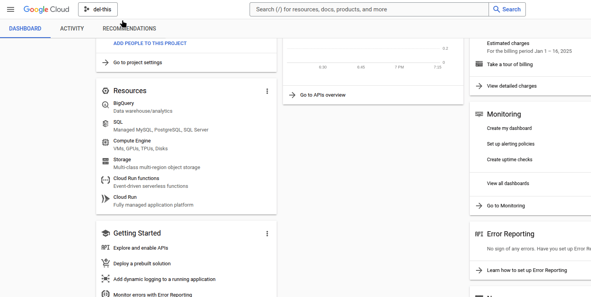
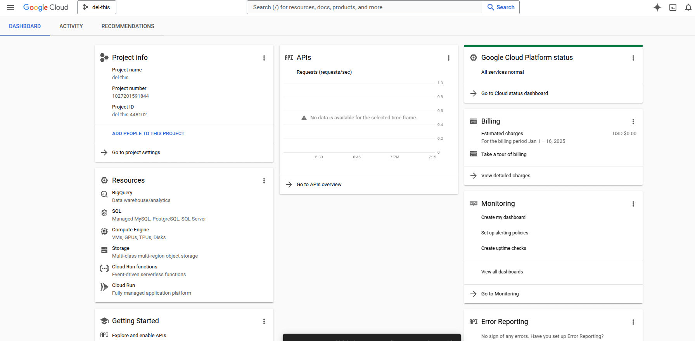
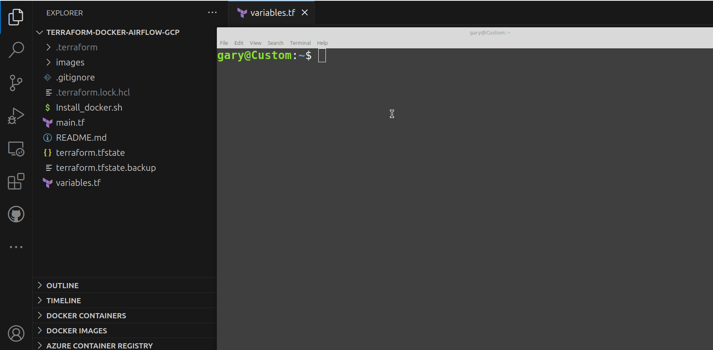
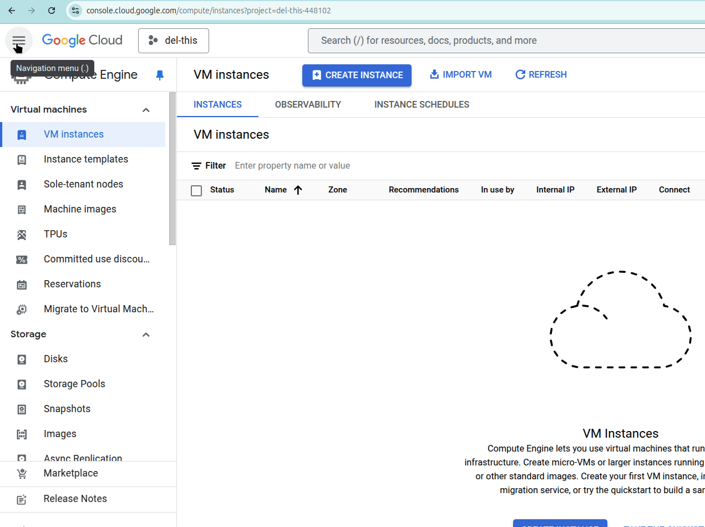

# Terraform-Docker-Airflow-GCP
Terraform Files to Create a GCP VM Install Docker Docker-Compose and Run Airflow

## Create a Project in GCP

## Create a Service Account and Download the Key
Create a Service Account and give it Compute Engine Admin Permissions 
Generate and download a key for the Service Account 

Create a ./google directory and add your .json key there 
Name it terra-airflow or update the varaibles.tf file variable 

## Update the Variables.tf File 
Update the variables in variables.tf to match your project. 
A good way to do this is to look at the Dashboard for the project name 
Go to Compute Engine and click the Create Instance button. 
The default shown for Region and Zone are most likely what you want to use. 
